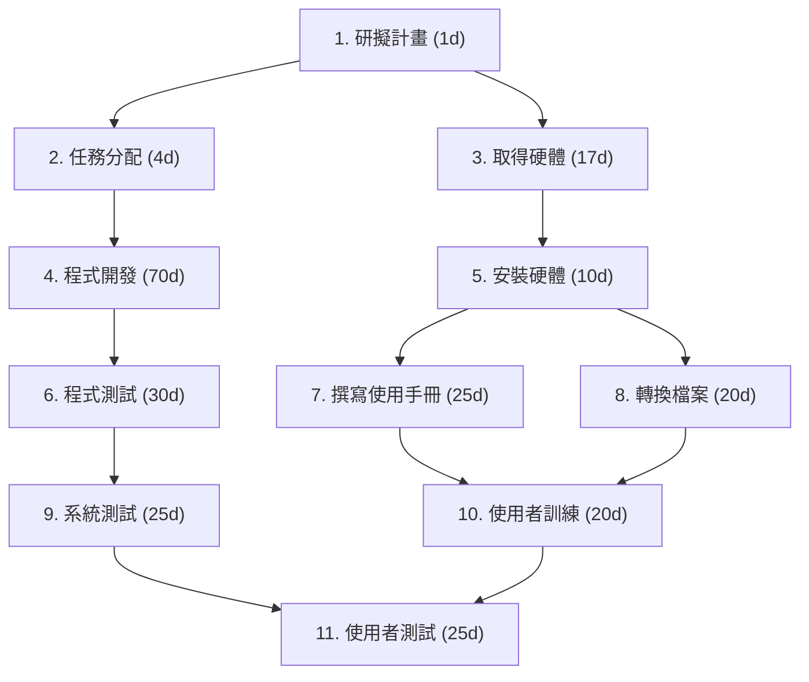

# hw2

```mermaid

gantt
    title 甘特圖
    dateFormat  YYYY-MM-DD
    excludes    weekends

    %% 專案開始日期
    %% 以2025-10-06為起點


    1. 研擬計畫           :done,    t1, 2025-10-06, 1d
    2. 任務分配           :active,  t2, after t1, 4d


    3. 取得硬體           :         t3, after t1, 17d


    4. 程式開發           :         t4, after t2, 70d
    5. 安裝硬體           :         t5, after t3, 10d


    6. 程式測試           :         t6, after t4, 30d
    9. 系統測試           :         t9, after t6, 25d
    11. 使用者測試         :         t11, after t9, 25d


    7. 撰寫使用手冊       :         t7, after t5, 25d
    8. 轉換檔案           :         t8, after t5, 20d
    10. 使用者訓練         :         t10, after t7 t8, 20d

